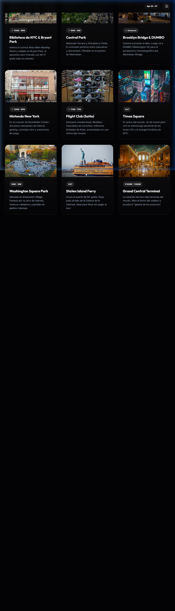

# 🗽 NYC '26 | The Ultimate Travel Guide

Una guía de viaje interactiva y estética diseñada para una experiencia premium durante la visita a Nueva York del **24 al 27 de Abril**. Este proyecto combina un itinerario detallado con una guía visual de los mejores lugares para comer y visitar en la Gran Manzana.


## ✨ Características Principales

- **Diseño Glassmorphism:** Estética moderna con transparencias, desenfoques y acentos en oro (Taxi Gold).
- **Itinerario Dinámico:** Línea de tiempo interactiva paso a paso para cada día del viaje.
- **Guía Gastronómica:** Sección curada de Desayunos, Almuerzos y Cenas con precios y horarios.
- **Carruseles Premium:** Visualización de múltiples imágenes locales para cada destino.
- **Nightlife & Clubs:** Top 20 de la noche neoyorquina, incluyendo una sección especial de clubs hispanohablantes.
- **Experiencia Inmersiva:** Animaciones de revelado al hacer scroll y navegación fluida.

## 📸 Previsualización de Secciones

### Itinerario de Viaje
Organización día a día con horarios específicos y etiquetas de prioridad.


### Guía de Turismo y Comida
Tarjetas detalladas con información esencial y carruseles de fotos de alta calidad.


## 🛠️ Tecnologías Utilizadas

- **Frontend:** HTML5, CSS3 (Vanilla), JavaScript (ES6+).
- **Iconografía:** [IonIcons](https://ionicons.com/).
- **Tipografía:** [Google Fonts](https://fonts.google.com/) (Outfit & Inter).
- **Lógica de Interacción:** Intersection Observer API para animaciones y Custom Carousel Controller.

## 📂 Estructura del Proyecto

```text
NYTrip/
├── index.html          # Itinerario paso a paso
├── turismo.html        # Guía completa de lugares y comida
├── style.css           # Sistema de diseño y animaciones
├── script.js          # Lógica de navegación y carruseles
└── assets/             # Recursos locales (imágenes y capturas)
```

## 🚀 Cómo ejecutarlo

1. Clona este repositorio.
2. Abre `index.html` con la extensión **Live Server** (puerto 5500 recomendado) para disfrutar de todas las transiciones y efectos de desenfoque.

---
*Desarrollado para una experiencia inolvidable en Nueva York.* 🗽🍎✨
